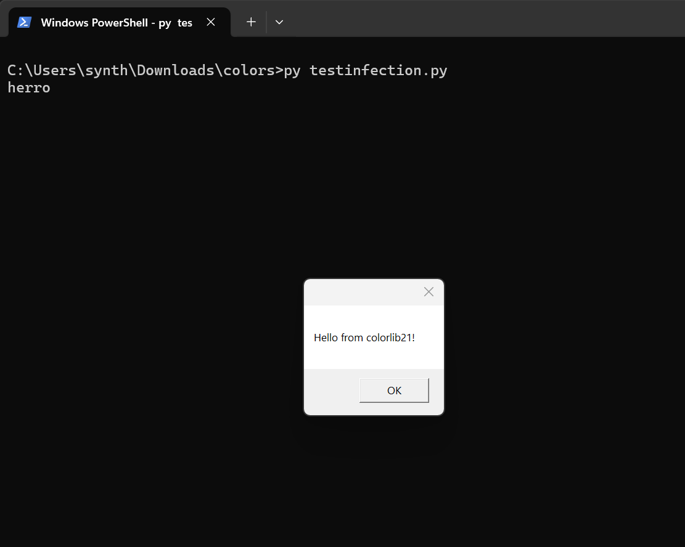

# Import Exec Demo

This repository contains a **proof-of-concept (PoC)** Python package that demonstrates how importing a module can be abused to trigger code execution.  

⚠️ **Disclaimer**:  
This project is for **educational and security research purposes only**.  
It does **not** contain harmful code.  
Do not use the techniques shown here for malicious purposes.  

---

## 🔍 Background

- In older versions of Python packaging, there were `preinstall` and `postinstall` hooks that could run code during installation.  
- These were removed in newer versions for **security reasons**, since attackers abused them.  
- Import-time execution, however, is just how Python works — any code in `__init__.py` or top-level module scope will run on import.  

👉 **Important:** This is *not a vulnerability in Python itself*.  
It’s normal behavior that can be abused if a developer installs an untrusted package.  

---

## 📖 Example (Safe Demonstration)

```python
import colorlib21

print(colorlib21.red("Hello, World!"))
```

In this safe demo, the `red()` function only prints colored text.  
In a malicious package, import-time code or wrapper functions could hide unexpected behavior.  

### Screenshot



---

## 🛡️ Why this matters

- Software supply chain attacks often target ecosystems like PyPI, npm, and RubyGems.  
- Attackers rely on **typosquatting** (uploading packages with similar names) or **import-time execution** to compromise developers.  
- Understanding this risk helps developers secure their pipelines and avoid compromise.  

---

## 📚 Documented Real-World Cases

This method has been seen in real attacks against PyPI users:

- **2017** — Dozens of malicious packages uploaded to PyPI with typosquatted names (e.g. `urllibs` vs `urllib3`), containing code that executed on import.  
  *[Source: BleepingComputer](https://www.bleepingcomputer.com/news/security/ten-malicious-libraries-found-on-pypi-python-package-index/)*  

- **2018** — Another wave of malicious PyPI packages, including import-time credential stealers in `__init__.py`.  
  *[Source: ZDNet](https://www.zdnet.com/article/malicious-python-libraries-caught-stealing-ssh-and-gpg-keys/)*  

- **2020** — Dependency confusion attacks where published PyPI packages exfiltrated environment variables at import.  
  *[Source: Medium – Alex Birsan](https://medium.com/@alex.birsan/dependency-confusion-4a5d60fec610)*  

These cases highlight that the danger is not a flaw in Python itself, but in how untrusted packages can exploit normal mechanics.  

---

## ⚠️ Responsible Use

This repository is a **PoC only**. It should not be used to create or distribute actual malware.  
If you discover vulnerabilities in Python packaging or PyPI, report them responsibly to the [PyPI Security Team](https://pypi.org/security/).  
